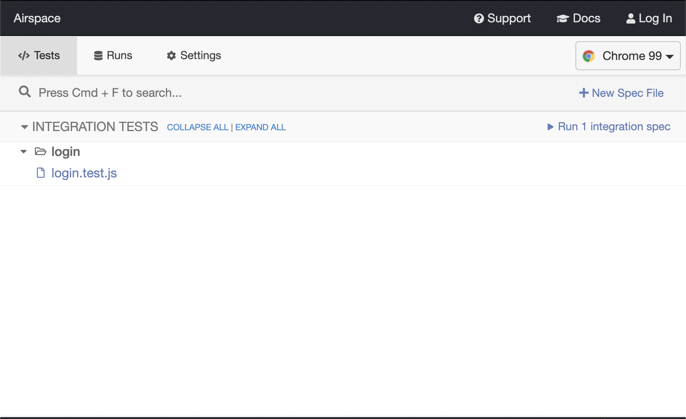
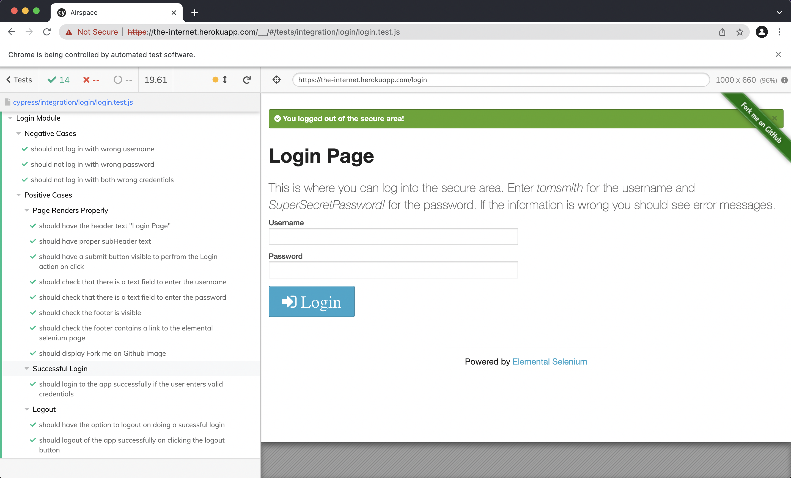

# Airspace QA assignment

## Description
This is an assignment to test the login functionality of the application provided by Airspace, which can be found [here](https://the-internet.herokuapp.com/login).  

I Have Used [Cypress](https://www.cypress.io/) to create and execute these test cases, ```npm``` as the package manager for managing the dependencies.

## Steps to run the assignment
1. Clone this repository.
2. Navigate to the root folder of the assignment
3. Open a terminal at this location
4. Run the command ```npm install```. This will install all the dependencies needed for the application (in this case, it will install Cypress).
5. Run the command ```npm start```. This will start the cypress engine and will display all the modules. The screen should look like this:
 
6. Click on 'login.test.js'. This should start executing the test cases inside the Login Test file.
7. On completion, you should be able to able to see the passed test cases like this:

